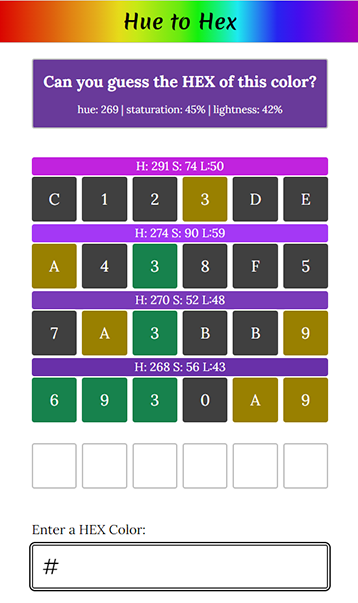

# Hue to Hex

Welcome to Hue to Hex, where the vibrant world of colors comes alive through your screen! In this exciting and visually stimulating game, your color knowledge will be put to the test.

'Hue to Hex' provides an educational and enjoyable way for users to explore color representations in the digital world while enhancing their knowledge of hex color codes.

**Link to project:** http://recruiters-love-seeing-live-demos.com/



## How to Play

Hue to Hex is an interactive web-based color game that leverages the power of web technologies to engage and challenge users with a test of their color identification skills. Built using React and TypeScript, this game presents players with a visual representation of a color based on its hue, saturation, and lightness (HSL) values. Players are then tasked with entering the correct hexadecimal (hex) color code that matches the displayed color.

Each time you guess you will be given, visually, the color you just guessed and a Wordle like representation of the characters in the HEX code guessed.

- Grey background characters are not in the secret hex
- Yellow background characters are within the hex but not in the correct location
- Green characters are in the correct location within the hex

## How It's Made:

**Tech used:** HTML, CSS, TypeScript, React

The game employs a combination of DOM manipulation and CSS styles using React to dynamically render colors and provide real-time feedback to the player. A random HSL value is generated for each round, and the corresponding color is displayed within a user-friendly interface. A text input field allows players to enter their best guess for the hex color code, and upon submission, the game checks the accuracy of the response.

## Color contrast accessibility with random colors

Something that became clear early on when I was building this application was that I wanted to have text on the random color that was generated. At first I had all the text black and this caused the text on darker colors to be unreadable. At first I thought this was going to be a big problem but with some research I learned that calculating color contrast is surprisingly easy. Here's two ways to do it.

### Hex value

The first way takes the hex value of the color and checks if it is closer to white or black. If it the value is less than half its closer to black and so returns white while if greater than half the color is lighter so it returns black.

```JavaScript
function getContrast(hexColor){
    return (parseInt(hexColor, 16) > 0xffffff/2) ? 'black':'white';
}
```

### YIQ

The second way uses something called [YIQ](https://en.wikipedia.org/wiki/YIQ) which takes into account the different parts of the of the colors values that make up the given color. It breaks down the the hex color into red, green, and blue values. It then uses these to determine if the color is lighter or darker.

```JavaScript
function getContrastYIQ(hexColor){
	var r = parseInt(hexColor.substr(0,2),16);
	var g = parseInt(hexColor.substr(2,2),16);
	var b = parseInt(hexColor.substr(4,2),16);
	var yiq = ((r*299)+(g*587)+(b*114))/1000;
	return (yiq >= 128) ? 'black' : 'white';
}
```

## Optimizations

- Add in animations for when the color is guessed
- Add in difficulty levels and time limits

## Lessons Learned:

In this project I tried to focus on making sure that everything is typed well. Even in a smaller application like this I can see the value of having your props, state, returns, and function parameters typed. Color is an object in this app that is used almost everywhere. Knowing that whenever I used it that it would always have the correct properties made building the app a breeze.

Its a little extra typing, but having the props and their types at the top made debugging smoother and just makes the code easier to read. The intellisense is vsCode probably saved about as much time as it took to add the types as well. I can say that for any future personal projects where it is possible I will be using TypeScript.
